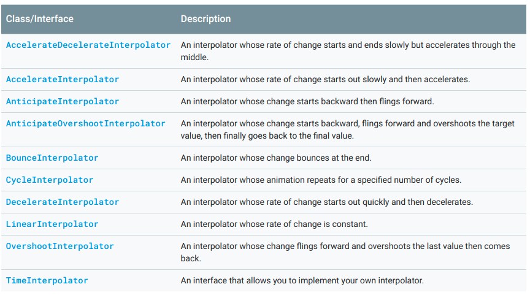
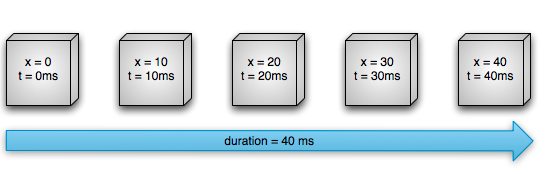
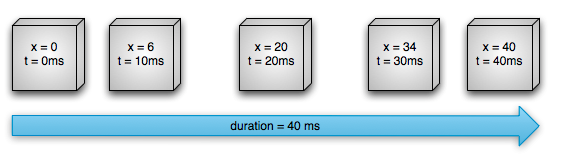

# Animations and Transitions


## Property Animation Overview
You can define an animation to change any object property over time, regardless of whether it draws to the screen or not. 
*A property animation changes a property's value over a specified length of time*. To animate something, you specify
the object property that you want to animate, such as an object's position on the screen, how long you want to animate it for,
and what values you want to animate between. The property animation system lets you define the following characteristics of an animation: 

* Duration: <br>
You can specify the duration of an animation. The default length is 300ms. <br>
* Time Interpolation: <br>
You can specify how the values for the property are calculated as a function of the animation's current elapsed time. <br>
<br>
* Repeat count and Behavior: <br>
You can specify whether or not to have an animation repeat when it reaches the end of a duration and how many times to repeat the animation. 
You can also specify whether you want the animation to play back in reverse. Setting it to reverse plays the animation forwards then backwards
repeatedly, until the number of repeats is reached. <br>
* Animator Sets: <br>
You can group animations into logical sets that play together or sequentially or after specified delays. <br>
* Frame Refresh Delay: <br>
You can specify how often to refresh frames of your animation. The default is set to refresh every 10ms.


### Example: 
**Time Interpolation**: Linear Interpolation Animation, object moves at a constant speed <br>
**Frame Refresh Delay**: 10ms, Every 10 seconds, the object moves horizontally by 10 pixels. <br>
 <br>

**Time Interpolation**: AccelerateDecelerateInterpolator, object accelerates up to the halfway point then decelerates from the halfway point until the end of the 
animation. <br>
 <br>

### API Overview
**ValueAnimator**: <br>
This class lets you animate values of some type for the duration of an animation by specifying a set of int, float, or color values to animate through.
```
// Initialize the start and ending values that we are going to move through
ValueAnimator animation = ValueAnimator.ofFloat(0f, 100f);
// Set how long the animation should last
animation.setDuration(1000);
// The update listener that incrementally does what we want to the view
animation.setUpdateListener(new ValueAnimator.AnimatorUpdateListener() {
    @Override
    public void onAnimationUpdate(ValueAnimator updatedAnimation) {
        float animatedValue = (float) updatedAnimation.getAnimatedValue();
        textView.setTranslationX(animatedValue);
    }
})
// Start the animation when we want it
animation.start();
```
**ObjectAnimator**: <br>
Allows us to animate a named property of a target object. This makes animating any object much easier since you do not need to implement the 
listener for the ValueAnimator anymore.
```
ObjectAnimator animation = ObjectAnimator.ofFloat(textView, "translationX", 100f);
animation.setDuration(1000);
animation.start();
```
Prerequisites for the ObjectAnimator to Work: <br>
* The object property that you are animating must have a setter function (in camel case) in the form of set<PropertyName>(). Because the ObjectAnimator automatically updates the property during animation, it must be able to access the property with this setter method. For example, if the property name is foo, you need to have a setFoo() method. If this setter method does not exist, you have three options:
    * Add the setter method to the class if you have the rights to do so.
    * Use a wrapper class that you have rights to change and have that wrapper receive the value with a valid setter method and forward it to the original object.
    * Use ValueAnimator instead.
* If you specify only one value for the values... parameter in one of the ObjectAnimator factory methods, it is assumed to be the ending value of the animation. Therefore, the object property that you are animating must have a getter function that is used to obtain the starting value of the animation. The getter function must be in the form of get<PropertyName>(). For example, if the property name is foo, you need to have a getFoo() method.
* The getter (if needed) and setter methods of the property that you are animating must operate on the same type as the starting and ending values that you specify to ObjectAnimator. For example, you must have targetObject.setPropName(float) and targetObject.getPropName(float) if you construct the following ObjectAnimator:
ObjectAnimator.ofFloat(targetObject, "propName", 1f)
* Depending on what property or object you are animating, you might need to call the invalidate() method on a View to force the screen to redraw itself with the updated animated values. You do this in the onAnimationUpdate() callback. For example, animating the color property of a Drawable object only causes updates to the screen when that object redraws itself. All of the property setters on View, such as setAlpha() and setTranslationX() invalidate the View properly, so you do not need to invalidate the View when calling these methods with new values. For more information on listeners, see the section about Animation listeners.

**ViewPropertyAnimator**: <br>
Provides a simple way to animate several properties of a **View** in parallel, using a single underlying **Animator** object. It is more efficent when animating many properties at once.
```
myView.animate().x(50f).y(100f);
```
**AnimatorSet**:<br>
Allows the bundling of animations together so that you can specify whether to start animations simultaneously, sequentially, or after a specified delay. You can also nest **AnimatorSet** objects within each other.
1. Plays bounceAnim.
2. Plays squashAnim1, squashAnim2, stretchAnim1, and stretchAnim2 at the same time.
3. Plays bounceBackAnim.
4. Plays fadeAnim.
```
AnimatorSet bouncer = new AnimatorSet();
bouncer.play(bounceAnim).before(squashAnim1);
bouncer.play(squashAnim1).with(squashAnim2);
bouncer.play(squashAnim1).with(stretchAnim1);
bouncer.play(squashAnim1).with(stretchAnim2);
bouncer.play(bounceBackAnim).after(stretchAnim2);
ValueAnimator fadeAnim = ObjectAnimator.ofFloat(newBall, "alpha", 1f, 0f);
fadeAnim.setDuration(250);
AnimatorSet animatorSet = new AnimatorSet();
animatorSet.play(bouncer).before(fadeAnim);
animatorSet.start();
```

## View Animation
The view animation system provides the capability to only animate **View** objects. The view animation also restricts which aspects of a **View** object
to animate, such as the scaling and rotation of a **View** but not the background color, for instance. **View Animation** also only modifies where the **View**
was drawn, and not the actual View itself. For instance, if you animated a button to move across the screen, the button draws correctly, but the actual location where you can click the button does not change, so you have to implement your own logic to handle this.

### View Animation vs Property Animation
1. Property Animations allow you to animate any property of any object (Views and non-Views) and the object itself is actually modified.
2. View Animations take less time to setup and requires less code
3. Use View Animations if they accomplish everything that you need to do and you do not need to use the property animation system.
   
## Animate Layout Changes to ViewGroup Objects
You can animate layout changes within a ViewGroup with the **LayoutTransition** class. Views inside a ViewGroup can go through an appearing and disappearing animation when you add them to or remove them from a ViewGroup or when you call a **View**'s **setVisibility()** method. The remaining Views in the ViewGroup can also animate into their new positions when you add or remove Views.

## Animate View State Changes using StateListAnimator
The **StateListAnimator** class allows you to define animators that run when the state of a view changes. This object
behaves as a wrapper for an **Animator** object, calling that animation whenever the specified view state (such as "pressed" or "focused") changes. The **StateListAnimator** can be defined in an XML resource with a root \<selector> element and child \<item> elements that each specify a different view state defined by the **StateListAnimator** class. Each \<item> contains the definition for a **property animation set**.
```
<?xml version="1.0" encoding="utf-8"?>
<selector xmlns:android="http://schemas.android.com/apk/res/android">
    <!-- the pressed state; increase x and y size to 150% -->
    <item android:state_pressed="true">
        <set>
            <objectAnimator android:propertyName="scaleX"
                android:duration="@android:integer/config_shortAnimTime"
                android:valueTo="1.5"
                android:valueType="floatType"/>
            <objectAnimator android:propertyName="scaleY"
                android:duration="@android:integer/config_shortAnimTime"
                android:valueTo="1.5"
                android:valueType="floatType"/>
        </set>
    </item>
    <!-- the default, non-pressed state; set x and y size to 100% -->
    <item android:state_pressed="false">
        <set>
            <objectAnimator android:propertyName="scaleX"
                android:duration="@android:integer/config_shortAnimTime"
                android:valueTo="1"
                android:valueType="floatType"/>
            <objectAnimator android:propertyName="scaleY"
                android:duration="@android:integer/config_shortAnimTime"
                android:valueTo="1"
                android:valueType="floatType"/>
        </set>
    </item>
</selector>
```
To attach the state list animator to a view, add the **android:stateListAnimator** attribute as follows:
```
<Button android:stateListAnimator="@xml/animate_scale"
        ... />
```

## Using XML Files to Declare Animations
This allows easy reusability for animations in multiple activities and the ability to more easily edit the animation sequence. The following
plays the two sets of object animations sequentially, with the first nested set playing two object animations together.
```
<set android:ordering="sequentially">
    <set>
        <objectAnimator
            android:propertyName="x"
            android:duration="500"
            android:valueTo="400"
            android:valueType="intType"/>
        <objectAnimator
            android:propertyName="y"
            android:duration="500"
            android:valueTo="300"
            android:valueType="intType"/>
    </set>
    <objectAnimator
        android:propertyName="alpha"
        android:duration="500"
        android:valueTo="1f"/>
</set>

// ValueAnimator in some other XML file
<animator xmlns:android="http://schemas.android.com/apk/res/android"
    android:duration="1000"
    android:valueType="floatType"
    android:valueFrom="0f"
    android:valueTo="-100f" />
```
To run the animation, you must inflate the XML resources in your code to an **AnimatorSet** object, and then set the target objects for all of the animations before starting the animation set. 
```
AnimatorSet set = (AnimatorSet) AnimatorInflater.loadAnimator(myContext,
    R.animator.property_animator);
set.setTarget(myObject);
set.start();
```
For the ValueAnimator
```
ValueAnimator xmlAnimator = (ValueAnimator) AnimatorInflater.loadAnimator(this,
        R.animator.animator);
xmlAnimator.addUpdateListener(new ValueAnimator.AnimatorUpdateListener() {
    @Override
    public void onAnimationUpdate(ValueAnimator updatedAnimation) {
        float animatedValue = (float)updatedAnimation.getAnimatedValue();
        textView.setTranslationX(animatedValue);
    }
});
xmlAnimator.start();
```

For in Depth Scenarios, Continue onto their sub-categories:
https://developer.android.com/guide/topics/graphics/drawable-animation

## Start an Activity Using an Animation
You can specify custom animations for enter and exit transitions and for transitions of shared elements between activities.
* **Enter Transitions**: Determines how views in an activity enter the scene. For example, in the *explode* enter transition, the views enter the scene from the outside and fly towards the center of the screen.
* **Exit Transition**: Determines how views in an activity exit the scene. For example, in the *explode* exit transition, the views exit the scene away from the center.
* **Shared Elements Transitions**: Determines how views that are shared between two activities transition between these activities. For example, if two activities have the same image in different positions and sizes, the **channelImageTransform** shared element transition translates and scales the image smoothly between these activities.
    * changeBounds: Animates the changes in layout bounds of target views.
    * changeClipBounds: Animates the changes in clip bounds of target views
    * changeTransform: Animates the changes in scale and roatation of target views
    * changeImageTransform: Animates changes in size and scale of target images


### Supported Enter and Exit Transitions
**Explode**: Moves views in or out from the center of the scene <br>
**Slide**: Moves views in or out from one of the edges of the scene <br>
**Fade**: Adds or removes a view from the scene by changing its opacity <br>


### Specifying Custom Transitions
1. Through XML: <br>
Enable window content transitions with the ```android:windowActivityTransitions``` attribute when you define a style that inherits from material theme.
```
<style name="BaseAppTheme" parent="android:Theme.Material">
  <!-- enable window content transitions -->
  <item name="android:windowActivityTransitions">true</item>

  <!-- specify enter and exit transitions -->
  <item name="android:windowEnterTransition">@transition/explode</item>
  <item name="android:windowExitTransition">@transition/explode</item>

  <!-- specify shared element transitions -->
  <item name="android:windowSharedElementEnterTransition">
    @transition/change_image_transform</item>
  <item name="android:windowSharedElementExitTransition">
    @transition/change_image_transform</item>
</style>

```
2. Programatically: <br>
```
// Enable window content transitions
getWindow().requestFeatures(Window.FEATURE_CONTENT_TRANSITIONS);

// Set an exit transition
getWindow().setExitTransition(new Explode());
```
To get the full effect of a transition, you msut enable window content transitions on both the calling and called activities. To start an enter transition as soon as possible, use the **Window.setAllowEnterTransitionOverlap()** function on the called activity. This lets you have a more dramatic enter transitions.

## Start an Activity Using Transitions
If you enable transitions and set an exit transition for an activity, the transition is activated when you launch another activity as follows:
```
startActivity(intent, ActivityOptions.makeSceneTransitionAnimation(this).toBundle());
```
