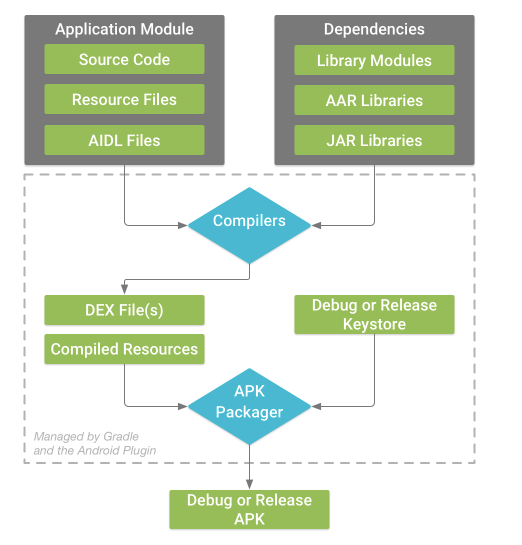

# The Build Process

1. The compilers convert the source code into DEX or Dalvik Executable file. These are bytecode that runs on Android devices, and everything else is compiled resources.
2. The APK Packger combines the DEX files and compiled resources into a single APK. Before the app can be installed and deployed onto an Android Device, however, the APK must be signed
3. The APK Packager signs your APK using either the debug or release keystore:
    1. Android Studio automatically configures new projects with a debug keystore for testing and profiling
    2. If you are building a release version of your app that you intend to release externally, the packager signs your app with the release keystore. For more, use the following link https://developer.android.com/studio/publish/app-signing#studio
4. Before generating your final APK, the packager uses the zipalign tool to optimize the application's performance to use less memory on a device

# Custom Build Configurations
***Build Types*** <br>
Build types define certain properties that Gradle uses when building and packaging your application which are typically configured for different stages of the development lifecycle. 
* The **debug** build type enables debug options and signs the APK with the debug key
* The **release** build type may shrink, obfuscate, and sign the APK with a release key for distribution <br>
  
***Product Flavors*** <br>
Different versions of your application that you may release to users, such as free and paid versions.
* Customize your application to use different code and resources while sharing and reusing the parts that are common to all versions of your application. <br>


***Manifest Entries*** <br>
You can specify values for some properties of the manmifest file in the build variation configuration. These build values overwrite the existing values in the manifest file. This is useful if you want to generate multiple APKs for your modules where each of the apk files has a different application name, minimum SDK version, or target SDK version. <br>

***Dependencies*** <br>
The build system manages project dependencies from your local filesystem and from remore repositories. <br>

***Signining*** <br>
The build system enables you to specify signing settings in the build configuration, and it can automatically sign your APKs during the build process. 

***ProGuard*** <br>
The build system enables you to specify a different ProGuard rules file for each build variant. The build system can run ProGuard to shink and obfuscate your classes during the build process.

***Multiple APK Support*** <br>
The build system enables you to automatically build different APKs that each contain only the code and resources needed for a specific screen density or Application Binary Interface.

## Gradle Settings File
**settings.gradle** <br> 
File located in the project root directory tells Gradle which modules it should include when building the application. For most projects, the file is simple and includes the following:
```
include ':app'
```
However, multi-module projects need to specify each module that should go into the final build. <br>

**Top-level Build File** or **Top Level build.gradle File** <br>
This file located in the root project directory defines build configurations that apply to all modules in the project. By default, the top-level build file uses the **buildscript** block to define the Gradle repositories and dependencies that are common to all modules in the project.
```
/**
 * The buildscript block is where you configure the repositories and
 * dependencies for Gradle itself—meaning, you should not include dependencies
 * for your modules here. For example, this block includes the Android plugin for
 * Gradle as a dependency because it provides the additional instructions Gradle
 * needs to build Android app modules.
 */

buildscript {

    /**
     * The repositories block configures the repositories Gradle uses to
     * search or download the dependencies. Gradle pre-configures support for remote
     * repositories such as JCenter, Maven Central, and Ivy. You can also use local
     * repositories or define your own remote repositories. The code below defines
     * JCenter as the repository Gradle should use to look for its dependencies.
     *
     * New projects created using Android Studio 3.0 and higher also include
     * Google's Maven repository.
     */

    repositories {
        google()
        jcenter()
    }

    /**
     * The dependencies block configures the dependencies Gradle needs to use
     * to build your project. The following line adds Android plugin for Gradle
     * version 3.2.1 as a classpath dependency.
     */

    dependencies {
        classpath 'com.android.tools.build:gradle:3.2.1'
    }
}

/**
 * The allprojects block is where you configure the repositories and
 * dependencies used by all modules in your project, such as third-party plugins
 * or libraries. However, you should configure module-specific dependencies in
 * each module-level build.gradle file. For new projects, Android Studio
 * includes JCenter and Google's Maven repository by default, but it does not
 * configure any dependencies (unless you select a template that requires some).
 */

allprojects {
   repositories {
       google()
       jcenter()
   }
}
```

**Module Level build.gradle files** <br>
Located in each project/module directory, this file allows you to configure build settings for the specific module it is located in. Configuring these build settings allows one to provide custom packaing options, such as additional build types and product flavors, and override settings in the **main/** app manifest or top-level **build.gradle** file.

```
/**
 * The first line in the build configuration applies the Android plugin for
 * Gradle to this build and makes the android block available to specify
 * Android-specific build options.
 */

apply plugin: 'com.android.application'

/**
 * The android block is where you configure all your Android-specific
 * build options.
 */

android {

  /**
   * compileSdkVersion specifies the Android API level Gradle should use to
   * compile your app. This means your app can use the API features included in
   * this API level and lower.
   */

  compileSdkVersion 28

  /**
   * buildToolsVersion specifies the version of the SDK build tools, command-line
   * utilities, and compiler that Gradle should use to build your app. You need to
   * download the build tools using the SDK Manager.
   *
   * This property is optional because the plugin uses a recommended version of
   * the build tools by default.
   */

  buildToolsVersion "28.0.3"

  /**
   * The defaultConfig block encapsulates default settings and entries for all
   * build variants, and can override some attributes in main/AndroidManifest.xml
   * dynamically from the build system. You can configure product flavors to override
   * these values for different versions of your app.
   */

  defaultConfig {

    /**
     * applicationId uniquely identifies the package for publishing.
     * However, your source code should still reference the package name
     * defined by the package attribute in the main/AndroidManifest.xml file.
     */

    applicationId 'com.example.myapp'

    // Defines the minimum API level required to run the app.
    minSdkVersion 15

    // Specifies the API level used to test the app.
    targetSdkVersion 28

    // Defines the version number of your app.
    versionCode 1

    // Defines a user-friendly version name for your app.
    versionName "1.0"
  }

  /**
   * The buildTypes block is where you can configure multiple build types.
   * By default, the build system defines two build types: debug and release. The
   * debug build type is not explicitly shown in the default build configuration,
   * but it includes debugging tools and is signed with the debug key. The release
   * build type applies Proguard settings and is not signed by default.
   */

  buildTypes {

    /**
     * By default, Android Studio configures the release build type to enable code
     * shrinking, using minifyEnabled, and specifies the Proguard settings file.
     */

    release {
        minifyEnabled true // Enables code shrinking for the release build type.
        proguardFiles getDefaultProguardFile('proguard-android.txt'), 'proguard-rules.pro'
    }
  }

  /**
   * The productFlavors block is where you can configure multiple product flavors.
   * This allows you to create different versions of your app that can
   * override the defaultConfig block with their own settings. Product flavors
   * are optional, and the build system does not create them by default.
   *
   * This example creates a free and paid product flavor. Each product flavor
   * then specifies its own application ID, so that they can exist on the Google
   * Play Store, or an Android device, simultaneously.
   *
   * If you declare product flavors, you must also declare flavor dimensions
   * and assign each flavor to a flavor dimension.
   */

  flavorDimensions "tier"
  productFlavors {
    free {
      dimension "tier"
      applicationId 'com.example.myapp.free'
    }

    paid {
      dimension "tier"
      applicationId 'com.example.myapp.paid'
    }
  }

  /**
   * The splits block is where you can configure different APK builds that
   * each contain only code and resources for a supported screen density or
   * ABI. You'll also need to configure your build so that each APK has a
   * different versionCode.
   */

  splits {
    // Settings to build multiple APKs based on screen density.
    density {

      // Enable or disable building multiple APKs.
      enable false

      // Exclude these densities when building multiple APKs.
      exclude "ldpi", "tvdpi", "xxxhdpi", "400dpi", "560dpi"
    }
  }
}

/**
 * The dependencies block in the module-level build configuration file
 * specifies dependencies required to build only the module itself.
 * To learn more, go to Add build dependencies.
 */

dependencies {
    implementation project(":lib")
    implementation 'com.android.support:appcompat-v7:28.0.0'
    implementation fileTree(dir: 'libs', include: ['*.jar'])
}
```