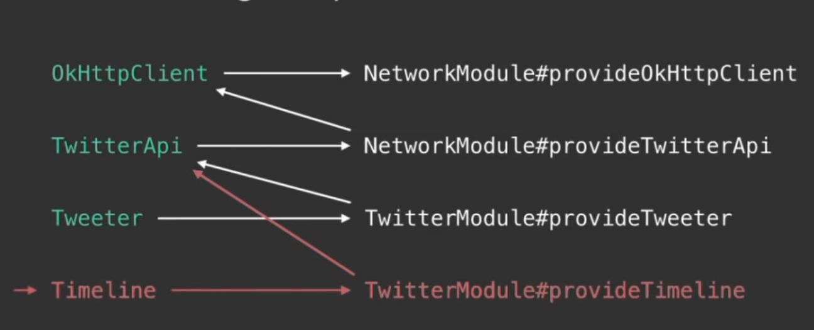

# Dagger
Idea - It shouldn't be a Class' job to instantiate and configure another class. Configure it outside of the class and pass it to its constructor

## API
@Module + @Provides : Designed to be partitioned and composed together
* Mechanism for providing dependencies
* **@Module** are classes whose methods provide dependencies. @Module on the class. Theseare responsible for providing objects which can be injected. Such classes can define methods annotated with @Provides.
* **@Provides** for the methods in the modules
```
@Module
public class NetworkModule{
    @Provides @Singleton
    OkHttpClient provideOkHttpClient() {
        return new OkHttpClient();
    }

    // Uses the Already created OkHttpClient from above
    @Provides @Singleton
    TwitterApi provideTwitterApi(OkHttpClient client) {
        return new TwitterApi(client);
    }
}

@Module
public class TwitterModule{
    private final String user;

    public TwitterModule(String user) {
        this.user = user;
    }

    @Provides @Singleton
    Tweeter provideTweeter(TwitterAPI api) {
        return new Tweeter(api, user);
    }

    @Provides @Singleton
    Timeline provideTimeline(TwitterApi api) {
        return new Timeline(api, user);
    }
}
```


Constructor @Inject
* Mechanism for requesting dependencies
* Can only have a single @Inject constructor
* Constructor paramters are dependencies
* Benefit of immutable objects
```
public class TwitterApplication {
    private final Tweeter tweeter;
    private final Timeline timeline;

    @Inject
    public TwitterApplication(Tweeter tweeter, Timeline timeline) {
        this.tweeter = tweeter;
        this.timeline = timeline;
    }
}
```

Method @Inject
* Method parameters are dependencies
* Injection happens after object is fully instantiated
```
@Singleton
public class TwitterApi {
    private final OkHttpClient client;

    @Inject
    public TwitterApi(OkHttpClient client) {
        this.client = client;
    }

    // Will create the Streaming object for you and input this object in it
    @Inject
    public void enableStreaming(Streaming streaming) {
        streaming.register(this);
    }
}
```

Field @Inject
* May not be private nor final
* Injection happens after the object is fully instantiated
* Object is usually responsible for or aware of injection
```
public class TwitterActivity extends Activity {
    @Inject Tweeter tweeter;
    @Inject Timeline timeline;
}
```

@Component
* Bridge between modules and injections
* The Injector
```
@Singleton
@Component(modules = {
    NetworkModule.class,
    TwitterModule.class,
})
public interface TwitterComponent{
    Tweeter tweeter();
    Timeline timeline();
    void injectApp(TwitterApplication app);
}

TwitterComponent component = Dagger_TwitterComponent.builder()
    .networkModule(new NetworkModule()) // <--- Contains default Constructor so you can take this out and dagger will create one for you
    .twitterMOdule(new TwitterMOdule("JakeWharton"))
    .build();

Tweeter tweeter = component.tweeter();
tweeter.tweet("Hello!");
Timeline timeline = component.timeline();
timeline.loadMore(20);

// For field injection
TwitterApplication app = new TwitterApplication();
component.injectApp(app);
app.run();
```
```
// Android Activity Example
@Singleton
@Component(modules = {
    NetworkMOdule.class,
    TwitterModule.class,
})
interface TwitterComponent {
    void injectActivity(TwitterActivity activity);
}

TwitterComponent component = Dagger_TwitterComponent.builder()
    .twitterModule(new TwitterModule("JakeWharton"))
    .builder();

TwitterActivity activity = // Android creates this
component.injectActivity(this);
```

## Scopes
```
@Singleton
@Component(modules = NetworkModule.class)
public interface ApiComponent{
    TwitterApi api();
}

// Above can be used as following
ApiComponent apiComponent = Dagger_ApiComponent.create(); // Create allows us to build all of its components if they all use a default constructor

// Will create multiple TwitterApplication instances
@Component(
    dependencies = ApiComponent.class, // Can no longer be created unless we have an instance of ApiComponent
    modules = TwitterModule.class
)
public interface TwitterComponent {
    TwitterApplication app();
}

// Above can be used as follow
TwitterComponent twitterComponent = Dagger_TwitterComponent.builder()
    .apiComponent(apiComponent)
    .twitterModule(new TwitterModule("Jake Wharton"))
    .build();
```

## Scope Annotations
@Singleton
* The largest scope
* Only creates a single instance