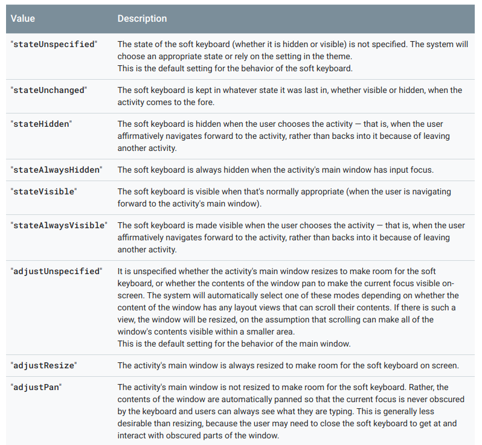

# Soft-Keyboard

# Manifest Tag
android:windowSoftInputMode: How the main window of the activity interacts with the Window containing the on-screen soft keyboard. The setting for this attribute affects two things:
* The state of the soft keyboard - whether it is hidden or visible - when the activity becomes the focus of user attention
* The adjustment made to the activity's main window - whether it is resized smaller to make room for the soft keyboard or whether its contents pan to make the current focus visible when part of the window is covered  by the soft keyboard

The setting must be one of the values listed in the following table, or a combination of one "state..." value plus one "adjust..." value. 

